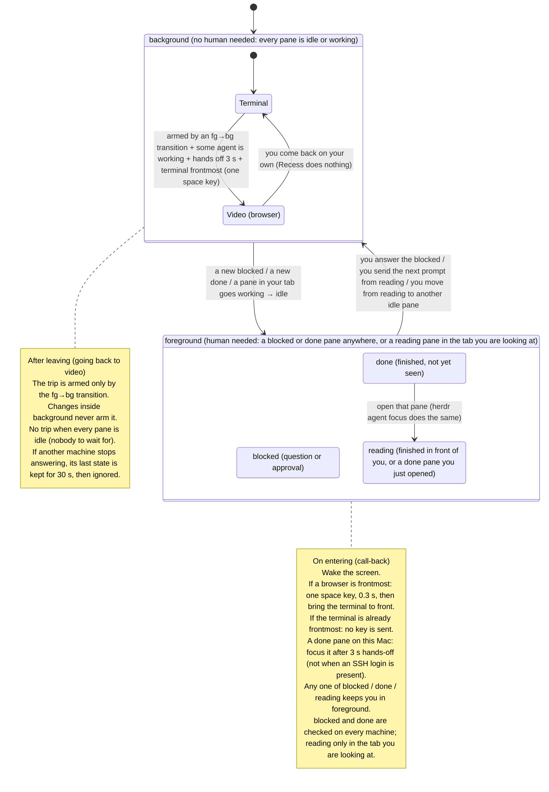
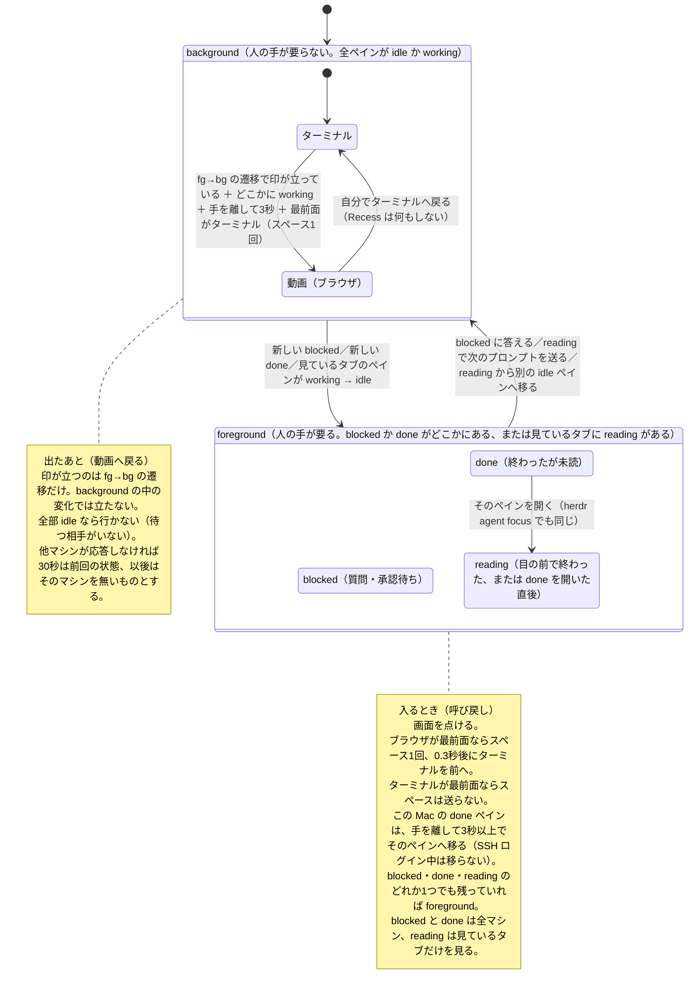

# Recess

English first, 日本語は後半（[日本語へ](#recess-日本語)）.

---

While your AI agent is working, a video plays in your browser. When the agent calls you, Recess pauses the video and brings you back to the terminal.

Recess is for people who run AI coding agents in a terminal on a Mac with [herdr](https://herdr.dev). The name comes from the only part of it that needs a permission: a tiny app that presses the space key.

## What happens

Recess is a resident program (one Python file, run by launchd) that asks herdr every 2 seconds what your agents are doing, on this Mac and on the machines you have registered in herdr. It keeps to three lines the author drew. Each line can be moved a little (see Settings). So far the lines have held for one night.

### Line 1. What it is allowed to do

- The resident program has no special permission. It runs `herdr`, `ssh`, `open`, `lsappinfo`, `ioreg`, `who` and `caffeinate`. None of these need Accessibility or Automation permission. It does not use `osascript`.
- It uses your existing ssh keys to run `herdr agent list` on the machines that are `enabled` in `herdr machine list`. Connections are shared, so this is not a new login every 2 seconds.
- The one act that needs a permission, sending a keystroke, is done by a separate app, `~/Applications/Recess.app`. Its script is one line of AppleScript: `tell application "System Events" to key code 49` (49 is the space key); `osadecompile` shows it. Around that line, `install.sh` sets a bundle identifier (`jp.feel-physics.Recess`), hides the app from the Dock and signs it ad hoc. The resident program can only launch it. It cannot change what it does.
- Two permissions go to Recess.app, and only to Recess.app: Accessibility (you add it by hand) and Automation for controlling System Events (a dialog the first time it presses space). Not to python3, not to your terminal.

### Line 2. When it moves you

"The tab you are looking at" below means the focused pane on the terminal where focus moved most recently (this Mac or a remote machine), together with the panes that sit in the same herdr tab. Two panes in one tab are judged as one.

**To the video** (the side that can interrupt you) it is slow and asks for a lot:

- an agent in the tab you are looking at is `working`;
- no pane in that tab is being read (see below);
- no agent anywhere is `blocked` (asking you something) or `done` (finished, unread);
- your hands have been off the keyboard and mouse for 3 seconds;
- the frontmost app is a terminal;
- at least 20 seconds have passed since Recess last called you back.

Then it brings the browser forward (the one you last used; Safari until then), checks with `lsappinfo` that it really is frontmost, and presses space once. If the browser has not come forward within 3 seconds, it presses nothing and writes why to the log.

It never goes to the video while the agents you are looking at are `idle`. That includes reading: a pane that just went from `done` or `working` to `idle` counts as being read until you move to another idle pane. It never goes while your hands are on the keys.

**Back to the terminal** (the side you asked for) it is immediate:

- a `blocked` or `done` appears that was not there 2 seconds ago, on any machine; or
- a pane in the tab you are looking at goes from `working` to `idle` (herdr skips `done` when you are watching).

Then it wakes the display, presses space once if you are not on the terminal, waits 0.3 seconds, and brings the terminal forward. If you are already on the terminal it presses nothing. `blocked` or `done` that already existed when Recess started do not call you.

One extra: when a pane on this Mac becomes `done`, your hands have been off for 3 seconds, and nobody is logged in over ssh (from a phone, say), it jumps to that pane with `herdr agent focus`.

### Line 3. How you come back

Space once, 0.3 seconds, terminal. That is the whole return path.

Space is a toggle. Recess does not know whether the video is playing. It sends one key at each transition and trusts that the video was paused while you were at the terminal. That is the deal you make with it: at the terminal, the video is paused.

## State diagram

Two big states. Recess only moves you on the transitions between them.



## Install

Two lines. Download, read, then run. Don't pipe curl into sh.

```sh
curl -fsSLO https://raw.githubusercontent.com/tatsuro-ueda/recess/main/install.sh
sh install.sh
```

Source and install files live on GitHub. The same file is also mirrored at `recess.feel-physics.jp` once that domain is live:

```sh
curl -fsSLO https://raw.githubusercontent.com/tatsuro-ueda/recess/main/install.sh
```

`install.sh` fetches the resident program, `recess-watch.py`, when it runs (from the same host, falling back to GitHub), unless a copy sits next to it. If you read before you run, read both; GitHub has the same files.

`install.sh` needs no sudo and does four things:

1. Puts the resident program at `~/.local/share/recess/recess-watch.py` (python3, standard library only).
2. Builds `~/Applications/Recess.app` on your Mac with `osacompile`, from the one line above. Nothing pre-built is downloaded. If a healthy Recess.app is already there, it is kept.
3. Writes `~/Library/LaunchAgents/jp.feel-physics.recess.plist` (RunAtLoad, KeepAlive, PATH = the directory where it found `herdr`, then `~/.local/bin:/usr/local/bin:/opt/homebrew/bin` and the system paths) and loads it.
4. Only with `sh install.sh --with-afplay`: puts a wrapper at `~/.local/bin/afplay` (see "The optional afplay wrapper"). Off by default.

Options:

- `--with-afplay`: see 4 above.
- `--rebuild-app`: rebuild Recess.app even if a healthy one exists. The permission may be lost (see "Known weaknesses").
- `--fetch`: download `recess-watch.py` even if a copy sits next to `install.sh`.
- `--dry-run`: print what it would do, change nothing, no network.

Running `install.sh` again without options is safe. It keeps Recess.app, puts `recess-watch.py` and the plist in place again, and re-registers the launchd job.

Recess starts right away, but it cannot press space until you do the next section.

## Give the permissions to Recess.app, and to nothing else

1. Open System Settings > Privacy & Security > Accessibility.
2. Click "+", press Cmd+Shift+G, type `~/Applications/Recess.app`, click Open, and turn the switch on.
3. The first time space is pressed, macOS asks whether "Recess" may control "System Events". Allow it. This is Automation permission, a second and separate prompt.
4. Do not add python3, Terminal, iTerm or anything else.

See what you just allowed:

```sh
osadecompile ~/Applications/Recess.app/Contents/Resources/Scripts/main.scpt
```

It prints the one line.

Try it: pause a video in the browser, run this in the terminal, and click the video within 5 seconds.

```sh
sleep 5; open -g -W ~/Applications/Recess.app
```

The video should start. If nothing happens, see "Known weaknesses" about permission after a rebuild.

Why not python3: Accessibility lets a process send any key to any app. The resident program is code an AI wrote, running unattended, with ssh into your other machines. Giving it that permission means trusting all of that at once. Giving it to a one-line app means trusting one line.

## Requirements

- macOS 14 or later. Tried on 14.3.1 only.
- herdr 0.9.1 or later, with `herdr` on PATH. `install.sh` records where it found herdr and hands that path to the resident program.
- python3 3.8 or later, standard library only. `/usr/bin/python3` works once the Command Line Tools are installed (`xcode-select --install`); without them `install.sh` looks for another python3 on PATH and stops if there is none.
- If `herdr machine list` has `enabled` machines: ssh to them must work without a prompt (key auth), and `herdr` must be on PATH in a non-interactive shell there. A machine that stops answering is logged as unreachable and its last known state is kept.
- A terminal whose process name is in `iTerm2 Terminal Ghostty kitty Alacritty WezTerm cmux` (see Settings). Only iTerm2 has been tried.

## Settings

All settings are environment variables. Put them in the `EnvironmentVariables` dict of `~/Library/LaunchAgents/jp.feel-physics.recess.plist`, then reload:

```sh
launchctl bootout   gui/$(id -u)/jp.feel-physics.recess
launchctl bootstrap gui/$(id -u) ~/Library/LaunchAgents/jp.feel-physics.recess.plist
```

| Variable | Default | What it does |
|---|---|---|
| `RECESS_HERDR_BIN` | set by `install.sh` to the herdr it found; otherwise `herdr` on PATH | Path to the herdr binary. |
| `RECESS_POLL_SECONDS` | `2` | How often to ask herdr. |
| `RECESS_HANDS_OFF_SECONDS` | `3` | Hands-off time before going to the video, and before an auto jump. |
| `RECESS_RETURN_COOLDOWN_SECONDS` | `20` | After calling you back, no video for this long. |
| `RECESS_TERMINAL_APPS` | `iTerm2 Terminal Ghostty kitty Alacritty WezTerm cmux` | Process names counted as "terminal", space-separated. |
| `RECESS_BROWSER_APPS` | `Safari,Comet,Google Chrome,Firefox,Arc,Brave Browser,Microsoft Edge` | App names counted as "browser", comma-separated. Only these are remembered as the place to return the video to. |
| `RECESS_VIDEO_APP` | (empty) | Force one browser, e.g. `Safari`. Empty = the browser you last used, Safari until then. |
| `RECESS_DEFAULT_TERMINAL` | `iTerm` | The app name passed to `open -a` when you are called back before Recess has seen you on a terminal. |
| `RECESS_DRY_RUN` | (unset) | `1` = write the decisions to the log but press nothing and switch nothing. |

A good first day: `RECESS_DRY_RUN=1`, read the log, then turn it on.

## Logs, stopping, removing

Log: `~/.local/state/recess/watch.log`. Most lines start with `state:` (a status summary, written when it changes), `PLAY`, `RETURN`, `TOGGLE`, `JUMP`, `WAKE`, or `remote <name>: unreachable` / `back`. launchd's own output goes to `watch.stdout.log` and `watch.stderr.log` in the same directory; look at `watch.stderr.log` when it does not start.

```sh
tail -f ~/.local/state/recess/watch.log          # watch it decide
launchctl print gui/$(id -u)/jp.feel-physics.recess | grep state   # is it running?
```

Stop (stays stopped until you bootstrap it again or log in again):

```sh
launchctl bootout gui/$(id -u)/jp.feel-physics.recess
```

Start again:

```sh
launchctl bootstrap gui/$(id -u) ~/Library/LaunchAgents/jp.feel-physics.recess.plist
```

Remove everything: `uninstall.sh` (next to `install.sh` in the repository) removes what `install.sh` put there. `--purge` also removes the logs and state, `--dry-run` only shows what it would do.

```sh
sh uninstall.sh            # add --purge to remove ~/.local/state/recess too
```

By hand, it is:

```sh
launchctl bootout gui/$(id -u)/jp.feel-physics.recess
rm ~/Library/LaunchAgents/jp.feel-physics.recess.plist
rm -r ~/.local/share/recess ~/.local/state/recess
rm -r ~/Applications/Recess.app
rm ~/.local/bin/afplay      # only if you installed with --with-afplay
```

Then remove Recess from the Accessibility list in System Settings, and from the Automation list if it is there. ssh connection-sharing sockets (`~/.ssh/ctl-recess-*`) close by themselves within 10 minutes.

### The optional afplay wrapper

herdr plays a sound when an agent finishes or asks. `--with-afplay` installs `~/.local/bin/afplay`, a short shell script: if its parent process is herdr, it wakes the display (`caffeinate -u -t 2`), appends one line to `~/.local/state/recess/sound.log` and then hands over to the real `/usr/bin/afplay`; for any other caller it just runs the real one. It only works if `~/.local/bin` comes before `/usr/bin` in the PATH of the shell that starts herdr. It is off by default because it shadows a system command.

## Switch it on and off

Recess keeps watching, but you decide when it may move you:

```sh
recess status    # ON or OFF
recess off       # watch only. No browser trips, no call-backs
recess on        # back to normal
recess toggle
```

`recess` is a symlink in `~/.local/bin`. The same switch is registered as a herdr plugin, so you can bind it to a key or run it from herdr:

```sh
herdr plugin action invoke recess.toggle   # also recess.on / recess.off / recess.status
```


## Known weaknesses

- Space is a toggle. Pause or play by hand and the next press goes the wrong way. Recess never reads playback state; keep the video paused while you are at the terminal.
- Tried with Safari and Netflix only. Other sites or players may not bind space to play/pause, or may not have the video focused.
- "Browser is frontmost" does not mean "right tab, video focused". If a text field or another tab has focus, space goes there.
- Rebuilding Recess.app (`sh install.sh --rebuild-app`, or a re-run that finds the app broken or built by an older `install.sh`; otherwise a plain re-run keeps it) can invalidate the permission. Remove Recess from the Accessibility list and add it again; if it is still refused, quit System Settings, open it again, and repeat. On the author's Mac, macOS had stored the permission by path but checked the identity of the new build.
- Tried only on macOS 14.3.1 with herdr 0.9.1 and iTerm2, on one Mac. No one has run it anywhere else yet.
- If you are called back while in an app that is neither a terminal nor a browser (Finder, an editor), it still brings the browser forward and presses space.
- It can take you to the video while you are thinking with your hands off the keys, as long as an agent in the tab you look at is `working`.
- A remote machine that stops answering keeps its last known state. It is not treated as gone.
- On a remote machine, `herdr agent list` runs in a non-interactive shell. If `~/.local/bin` is not on PATH there, the machine is silently treated as unreachable and Recess watches this Mac only. The log line `remote <name>: unreachable` is the only sign.
- While an `enabled` machine is down, one polling round can stretch to 5 seconds per such machine (ssh connect timeout).
- Hands-off time comes from this Mac's input devices. Typing over ssh from a phone does not count as hands; the auto jump checks `who` for that, the switch to the video does not.
- On a slow ssh link, a call from a remote machine arrives as late as the next `herdr agent list` does.

## Who wrote this

The code was written by an AI, coding agents running in the terminal. The purpose, the permissions and the way to stop it were decided by the author. It worked on the author's Mac (macOS 14.3.1, herdr 0.9.1, Safari, Netflix) on the night it was written, 2026-09-25 to 26, and the lines above are the ones that held. That is the whole track record so far.

## Author

Feel Physics / Tatsuro Ueda — [feel-physics.jp](https://feel-physics.jp/)

## License

MIT. See [LICENSE](LICENSE).

---

# Recess（日本語）

AI エージェントが働いている間はブラウザで動画を流し、呼ばれたら動画を止めてターミナルへ戻す。

Recess は、Mac のターミナルで [herdr](https://herdr.dev) を使って AI コーディングエージェントを動かしている人のためのものです。名前は、この仕組みの中で唯一許可が要る部分、スペースキーを押すだけの小さなアプリから来ています。

## 何が起きるか

Recess は常駐プログラム（Python ファイル1つ。launchd が動かす）で、2秒おきに herdr へ「エージェントはいま何をしているか」を聞きます。この Mac と、herdr に登録した他のマシンの両方です。そして、作者が引いた3本の線に従います。線は少し動かせます（「設定」を見てください）。いまのところ、線は一晩持っています。

### 線1 任せる範囲

- 常駐プログラム自身には特別な許可がありません。動かすのは `herdr`, `ssh`, `open`, `lsappinfo`, `ioreg`, `who`, `caffeinate` だけ。どれもアクセシビリティ許可もオートメーション許可も要りません。`osascript` は使いません。
- 他のマシンには、手元にある ssh 鍵を使って `herdr agent list` を実行しに行きます（`herdr machine list` で `enabled` のマシン）。接続は使い回すので、2秒ごとに新しいログインが起きるわけではありません。
- 許可が要る唯一の動作、キーを送ることは、別のアプリ `~/Applications/Recess.app` がやります。スクリプトは AppleScript 1行だけ：`tell application "System Events" to key code 49`（49 はスペースキー）。`osadecompile` で確認できます。その1行のまわりに、`install.sh` が識別子（`jp.feel-physics.Recess`）を付け、Dock に出ないようにし、ad-hoc 署名をします。常駐プログラムにできるのは、このアプリを起動することだけ。中身を変えることはできません。
- 許可は2つ、どちらも Recess.app にだけ出します。アクセシビリティ（手で追加する）と、System Events を制御するオートメーション（初めてスペースが送られるときのダイアログ）です。python3 にもターミナルにも出しません。

### 線2 呼ばれる時機

以下の「見ているタブ」とは、最後にフォーカスが動いた端末（この Mac でも他のマシンでも）でフォーカスされているペインと、herdr で同じタブに並んでいるペインのことです。同じタブの2ペインは一体として判断します。

**動画へ連れて行く側**（あなたの邪魔になりうる側）は慎重で、条件が多い：

- 見ているタブの AI が `working`
- そのタブに読み中のペインが無い（下を参照）
- どこにも `blocked`（質問中）や `done`（完了、未読）が無い
- キーボードとマウスから手を離して3秒
- 最前面がターミナル
- 最後に呼び戻されてから20秒以上

そろったら、ブラウザ（最後に使っていたもの。それまでは Safari）を前に出し、本当に最前面になったことを `lsappinfo` で確かめてから、スペースを1回押します。3秒たっても前に出なければ、押さずにログに理由を書きます。

見ているタブの AI が `idle` の間は動画へ行きません。読んでいる最中も含みます（`done` や `working` から `idle` になったペインは、別の idle ペインへ移るまで「読み中」）。手がキーに乗っている間も行きません。

**ターミナルへ呼び戻す側**（あなたが頼んだ側）は即時：

- 2秒前には無かった `blocked` か `done` が、どこかのマシンに現れた
- 見ているタブのペインが `working` から `idle` になった（見ている最中に終わると herdr は `done` を飛ばします）

このとき、画面を点け、ターミナルを見ていなければスペースを1回、0.3秒待ってターミナルを前に出します。すでにターミナルを見ていれば何も押しません。Recess が起動したときに既にあった `blocked` / `done` では呼びません。

もう1つ：この Mac のペインが `done` になり、手を離して3秒以上、ssh ログイン（スマホなど）が無ければ、`herdr agent focus` でそのペインへ飛びます。

### 線3 戻り方

スペース1回、0.3秒、ターミナル。戻り道はこれだけです。

スペースは切り替えです。Recess は動画が再生中かどうかを知りません。状態が変わった瞬間に1回キーを送るだけで、ターミナルにいる間は動画が止まっていたと信じています。それが Recess との約束です：ターミナルにいるとき、動画は止めておく。

## 状態遷移図

大きな状態は2つだけです。Recess があなたを動かすのは、その間の遷移のときだけです。



## 導入

2行です。落として、読んで、実行する。curl を sh へパイプしないでください。

```sh
curl -fsSLO https://raw.githubusercontent.com/tatsuro-ueda/recess/main/install.sh
sh install.sh
```

ソースと導入ファイルの正本は GitHub です。`recess.feel-physics.jp` が開通したら、同じものがそこにも出ます：

```sh
curl -fsSLO https://raw.githubusercontent.com/tatsuro-ueda/recess/main/install.sh
```

`install.sh` は実行時に常駐本体 `recess-watch.py` も取得します（同じホストから。落ちていれば GitHub から）。隣に同じファイルが置いてあればそれを使います。読んでから実行したい人は両方を読んでください。GitHub に同じものがあります。

`install.sh` は sudo 不要で、やることは4つ：

1. 常駐プログラムを `~/.local/share/recess/recess-watch.py` に置く（python3 標準ライブラリのみ）。
2. 上の1行から、あなたの Mac 上で `osacompile` を使って `~/Applications/Recess.app` を作る。ビルド済みのものは落としません。壊れていない Recess.app が既にあれば、そのまま残します。
3. `~/Library/LaunchAgents/jp.feel-physics.recess.plist` を書いて読み込む（RunAtLoad, KeepAlive, PATH は `herdr` が見つかったフォルダ、続けて `~/.local/bin:/usr/local/bin:/opt/homebrew/bin` とシステムのパス）。
4. `sh install.sh --with-afplay` のときだけ、`~/.local/bin/afplay` にラッパーを置く（「任意の afplay ラッパー」を参照）。既定では入れません。

オプション：

- `--with-afplay`：上の4。
- `--rebuild-app`：壊れていない Recess.app があっても作り直す。許可が外れることがあります（「分かっている弱点」を参照）。
- `--fetch`：`install.sh` の隣に `recess-watch.py` があっても使わず、取得元から取り直す。
- `--dry-run`：何をするかだけ表示して、何も変えない。通信もしない。

オプション無しで `install.sh` をもう一度走らせても大丈夫です。Recess.app は残し、`recess-watch.py` と plist を置き直して、launchd の登録をやり直します。

Recess はすぐ動き始めますが、次の節をやるまでスペースは押せません。

## 許可を Recess.app にだけ出す

1. システム設定 > プライバシーとセキュリティ > アクセシビリティ を開く。
2. 「+」を押し、Cmd+Shift+G で `~/Applications/Recess.app` と入力して「開く」。スイッチをオンにする。
3. 初めてスペースが送られるとき、macOS が「"Recess" が "System Events" を制御することを許可しますか」と聞いてきます。許可してください。これはオートメーション許可で、アクセシビリティとは別の2つ目のダイアログです。
4. python3、ターミナル、iTerm など、他のものは追加しない。

いま許可したものの中身を見る：

```sh
osadecompile ~/Applications/Recess.app/Contents/Resources/Scripts/main.scpt
```

1行だけ表示されます。

試す：ブラウザで動画を止めておき、ターミナルでこれを実行して、5秒以内に動画をクリックする。

```sh
sleep 5; open -g -W ~/Applications/Recess.app
```

動画が動き出すはずです。何も起きなければ「分かっている弱点」の、作り直し後の許可の項を見てください。

なぜ python3 に出さないか：アクセシビリティ許可は、そのプロセスがどのアプリにもどんなキーでも送れる許可です。常駐プログラムは AI が書いたコードで、見ていない間も動き、他のマシンへの ssh も握っています。そこに許可を出すのは、それ全部をまとめて信じることです。1行のアプリに出すのは、1行を信じることです。

## 動作の前提

- macOS 14 以降。確かめたのは 14.3.1 だけ。
- herdr 0.9.1 以降。`herdr` が PATH にあること。`install.sh` は見つけた場所を記録して、常駐プログラムに渡します。
- python3 3.8 以降（標準ライブラリのみ）。`/usr/bin/python3` は Command Line Tools（`xcode-select --install`）が入っていれば足ります。無ければ `install.sh` は PATH 上の別の python3 を探し、それも無ければ止まります。
- `herdr machine list` に `enabled` のマシンがある場合：そこへ ssh が聞き返し無しで通ること（鍵認証）と、相手側の非対話シェルで `herdr` が PATH にあること。応答しなくなったマシンは unreachable としてログに出し、最後に分かった状態を持ち続けます。
- プロセス名が `iTerm2 Terminal Ghostty kitty Alacritty WezTerm cmux` のどれかであるターミナル（「設定」参照）。確かめたのは iTerm2 だけ。

## 設定（環境変数）

設定はすべて環境変数です。`~/Library/LaunchAgents/jp.feel-physics.recess.plist` の `EnvironmentVariables` に書いて、載せ直します：

```sh
launchctl bootout   gui/$(id -u)/jp.feel-physics.recess
launchctl bootstrap gui/$(id -u) ~/Library/LaunchAgents/jp.feel-physics.recess.plist
```

| 変数 | 既定 | 意味 |
|---|---|---|
| `RECESS_HERDR_BIN` | `install.sh` が見つけた herdr の場所。無ければ PATH 上の `herdr` | herdr 実行ファイルの場所。 |
| `RECESS_POLL_SECONDS` | `2` | herdr に聞く間隔（秒）。 |
| `RECESS_HANDS_OFF_SECONDS` | `3` | 動画へ行く前、および自動ジャンプの前に、手を離して待つ秒数。 |
| `RECESS_RETURN_COOLDOWN_SECONDS` | `20` | 呼び戻したあと、この秒数は動画へ行かない。 |
| `RECESS_TERMINAL_APPS` | `iTerm2 Terminal Ghostty kitty Alacritty WezTerm cmux` | 「ターミナル」とみなすプロセス名。空白区切り。 |
| `RECESS_BROWSER_APPS` | `Safari,Comet,Google Chrome,Firefox,Arc,Brave Browser,Microsoft Edge` | 「ブラウザ」とみなすアプリ名。カンマ区切り。動画の戻り先として覚えるのはこれらだけ。 |
| `RECESS_VIDEO_APP` | （空） | ブラウザを決め打ちする（例 `Safari`）。空なら最後に使ったブラウザ、それまでは Safari。 |
| `RECESS_DEFAULT_TERMINAL` | `iTerm` | まだターミナルを見ていないうちに呼び戻されたとき、`open -a` に渡すアプリ名。 |
| `RECESS_DRY_RUN` | （未設定） | `1` で、判断はログに書くが何も押さず何も切り替えない。 |

最初の1日は `RECESS_DRY_RUN=1` でログだけ読み、それから本番にするのがおすすめです。

## ログと止め方・削除

ログ：`~/.local/state/recess/watch.log`。行頭はおもに `state:`（状態の要約。変わったときだけ書く）、`PLAY`、`RETURN`、`TOGGLE`、`JUMP`、`WAKE`、`remote <名前>: unreachable` / `back` のどれかです。launchd 自身の出力は同じフォルダの `watch.stdout.log` と `watch.stderr.log` に出ます。起動しないときは `watch.stderr.log` を見てください。

```sh
tail -f ~/.local/state/recess/watch.log          # 判断を眺める
launchctl print gui/$(id -u)/jp.feel-physics.recess | grep state   # 動いているか
```

止める（載せ直すか、次にログインするまで止まったまま）：

```sh
launchctl bootout gui/$(id -u)/jp.feel-physics.recess
```

動かす：

```sh
launchctl bootstrap gui/$(id -u) ~/Library/LaunchAgents/jp.feel-physics.recess.plist
```

全部消す：リポジトリで `install.sh` の隣にある `uninstall.sh` が、`install.sh` の置いたものを外します。`--purge` を付けるとログと状態も消し、`--dry-run` は何をするかを表示するだけです。

```sh
sh uninstall.sh            # ~/.local/state/recess も消すなら --purge
```

手で消すなら：

```sh
launchctl bootout gui/$(id -u)/jp.feel-physics.recess
rm ~/Library/LaunchAgents/jp.feel-physics.recess.plist
rm -r ~/.local/share/recess ~/.local/state/recess
rm -r ~/Applications/Recess.app
rm ~/.local/bin/afplay      # --with-afplay で入れたときだけ
```

そのあと、システム設定のアクセシビリティ一覧から Recess を外してください。オートメーション一覧に残っていればそれも外します。ssh の接続共有ソケット（`~/.ssh/ctl-recess-*`）は10分以内に勝手に閉じます。

### 任意の afplay ラッパー

herdr はエージェントが終わったときと質問したときに音を鳴らします。`--with-afplay` は `~/.local/bin/afplay` に短いシェルスクリプトを置きます。親プロセスが herdr なら画面を点け（`caffeinate -u -t 2`）、`~/.local/state/recess/sound.log` に1行書いてから本物の `/usr/bin/afplay` へ渡し、それ以外の呼び出し元なら本物をそのまま実行するだけです。herdr を起動するシェルの PATH で `~/.local/bin` が `/usr/bin` より前にあるときだけ効きます。システムのコマンドを覆い隠すので、既定では入れません。

## ON と OFF の切り替え

常駐は動いたまま、連れ出しと呼び戻しだけを止められます。

```sh
recess status    # ON か OFF か
recess off       # 見張るだけ。ブラウザへ行かず、呼び戻しもしない
recess on        # 元に戻す
recess toggle
```

`recess` は `~/.local/bin` のシンボリックリンクです。同じ切り替えが herdr のプラグインとしても登録されるので、herdr から実行したりキーに割り当てたりできます。

```sh
herdr plugin action invoke recess.toggle   # recess.on / recess.off / recess.status も同じ
```


## 分かっている弱点

- スペースは切り替えです。手で止めたり再生したりすると、次の1回が逆に効きます。Recess は再生状態を読みません。ターミナルにいる間は動画を止めておいてください。
- 確かめたのは Safari と Netflix だけ。他のサイトやプレーヤーではスペースが再生／停止に割り当てられていなかったり、動画にフォーカスが無かったりします。
- 「ブラウザが最前面」は「正しいタブで動画にフォーカスがある」と同じではありません。文字入力欄や別のタブにフォーカスがあれば、スペースはそこへ行きます。
- Recess.app を作り直す（`sh install.sh --rebuild-app`。再実行で app が壊れているか古い版と分かったときも作り直します。それ以外のただの再実行では作り直しません）と、許可が外れることがあります。アクセシビリティ一覧から Recess を削除して追加し直してください。それでも拒否されるときは、システム設定を終了してもう一度開き、同じことを繰り返します。作者の Mac では、macOS が許可をパスで記録しつつ、新しいビルドの識別を照合していました。
- 確かめたのは macOS 14.3.1、herdr 0.9.1、iTerm2、Mac 1台だけ。それ以外で動かした人はまだいません。
- ターミナルでもブラウザでもないアプリ（Finder やエディタ）を見ているときに呼び戻されると、それでもブラウザを前に出してスペースを押します。
- 見ているタブの AI が `working` なら、手を離して考えごとをしている最中でも動画へ連れて行かれることがあります。
- 応答しなくなった他のマシンは、最後に分かった状態を持ち続けます。いなくなった扱いにはしません。
- 他のマシンでは `herdr agent list` を非対話シェルで実行します。相手の PATH に `~/.local/bin` が無いと、黙って unreachable 扱いになり、この Mac だけの監視になります。気づける手がかりはログの `remote <名前>: unreachable` だけです。
- `enabled` のマシンが落ちている間は、1周が落ちているマシン1台につき最大5秒（ssh の接続待ち）延びます。
- 手を離した秒数はこの Mac の入力装置から取ります。スマホから ssh で打っていても「手」には数えません。自動ジャンプは `who` でそれを見ますが、動画への切り替えは見ません。
- ssh が遅いと、他のマシンからの呼び出しは次の `herdr agent list` が返るまで遅れます。

## 誰が書いたか

このコードは AI に書かせました。ターミナルで動くコーディングエージェントです。目的と、権限と、止め方を決めたのは作者です。書いた夜（2026年9月25日から26日）に作者の Mac（macOS 14.3.1、herdr 0.9.1、Safari、Netflix）で動き、上に書いた線がそのとき持ちこたえた線です。実績はいまのところそれだけです。

## 作者

Feel Physics / 植田達郎 — [feel-physics.jp](https://feel-physics.jp/)

## ライセンス

MIT。[LICENSE](LICENSE) を見てください。
