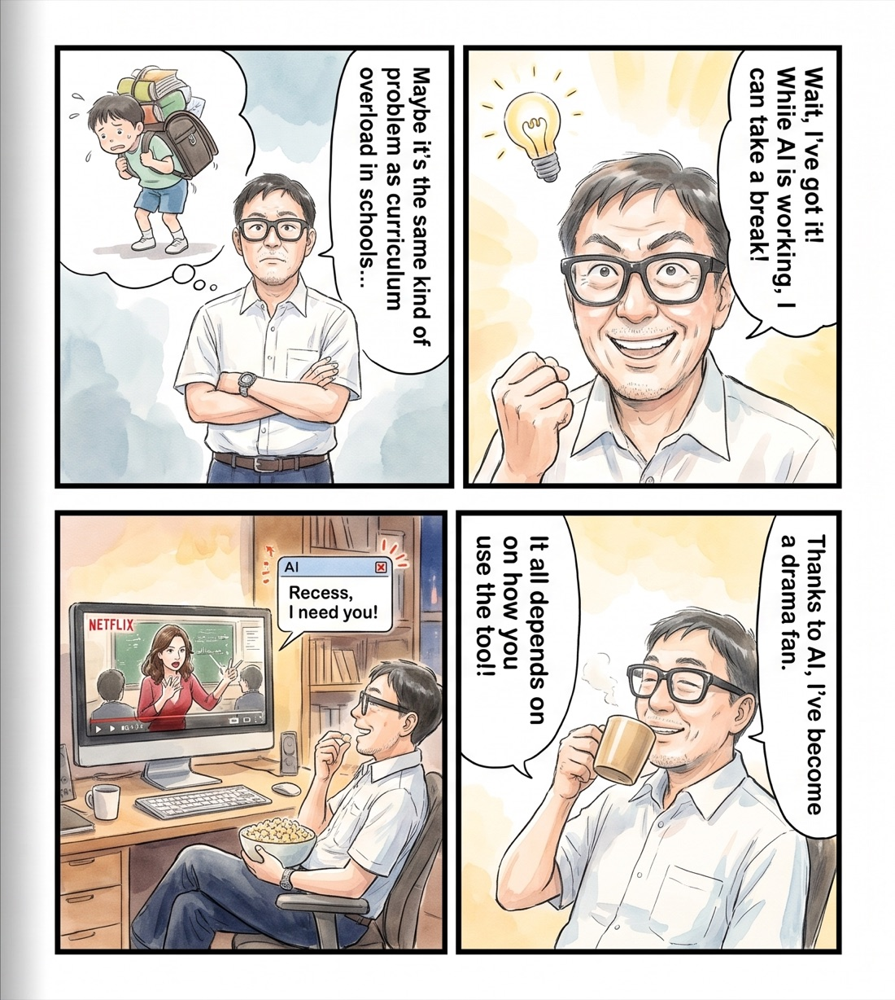
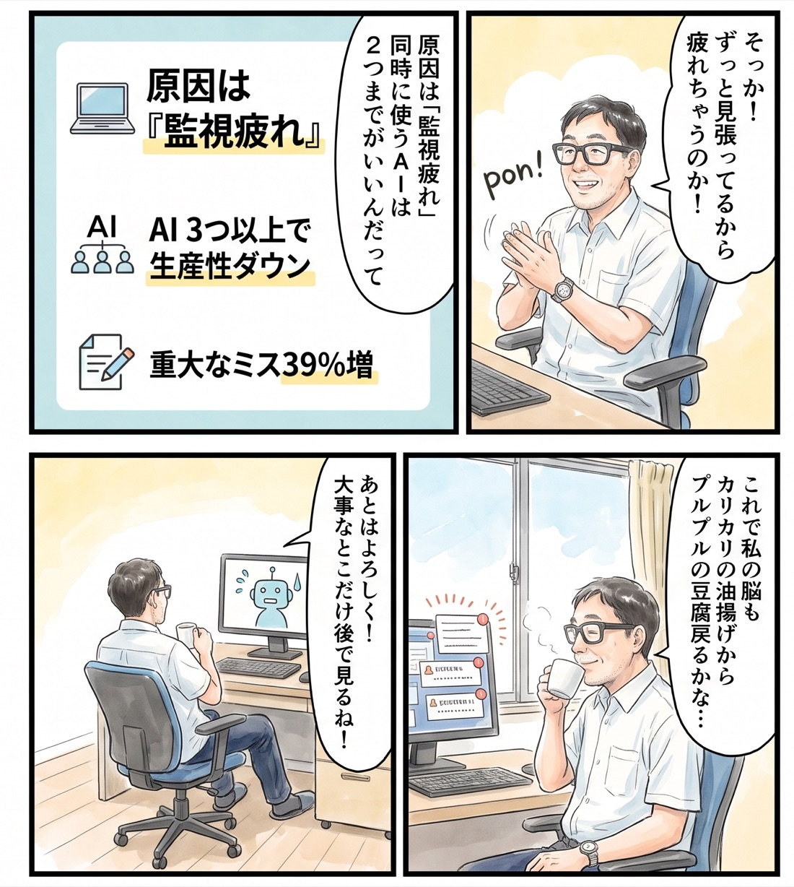

# Recess

AI works, you take recess. Your video plays by itself while the agents work, and pauses to bring you back to the terminal when herdr calls.

English first, 日本語は後半（[日本語へ](#recess-日本語)）.

## What hurts

It is night. In the terminal, a few AI agents are each working on something. I sit in front of them. I am not doing anything. I am watching the screen.

I am waiting to be called. A question may come, or the work may finish. So I cannot leave. If I leave, I will not notice when it stops. But while I watch, there is nothing for me to do.

I use AI agents every day, on purpose. And every day I feel my brain wearing down. Running dozens of agents nonstop is not something I want to do.

## What we want

"While the AI works, I want to spend my own time. But the moment my judgment is needed, I want to be back, reliably."

This is not "make the AI faster" or "run more AI". It is turning waiting time into my time.

## What we have been using

- Watching the screen. The most reliable, and the most tiring.
- herdr's sounds and toasts. I know I was called. But to hear the sound, I stay near the terminal anyway.
- My phone. I miss the call.
- Starting another terminal job. That turns waiting for AI into running more AI. It goes the wearing-down way.

None of them gave me both: leaving and coming back.

## Our conflict

| Force | What it is |
|---|---|
| Push | Waiting time disappears as blank. The fatigue of watching. A chronic, heavy headache. Run several agents and there is more to watch |
| Pull | A change of scene with a show. Half automatic, half forced (you can switch it off any time). When called, the show pauses and the terminal comes to front |
| Anxiety | Agents keep running in the background while I watch a show, and I do not know what they are doing |
| Habit | Nothing needs automating. When the agent starts running, just open the book you were reading |

Recess exists because of three lines drawn against the anxieties.

## What Recess does

- Only while an agent is working, it brings the browser to front and sends one space key. The show plays.
- When an agent asks a question or finishes, it sends one more space key and brings the terminal to front. The show pauses.
- The only thing that sends a key is `Recess.app`, a one-line AppleScript app. The Accessibility permission goes to that app and nothing else. The Python daemon gets none.

Three lines:

1. What I hand over: an unattended process gets one line's worth of permission, no more.
2. When I am called: leaving waits 3 seconds after my hands are off; calling back is immediate.
3. How I come back: one space key, 0.3 seconds, terminal.

`recess off` makes it watch only. "That's enough for today" is your call (see [Switch it on and off](docs/details.md#switch-it-on-and-off)).

I never watched Netflix. Now I watch it while the AI works. To me, that is surprising. What it was tested on, and what it cannot do, is in [Known weaknesses](docs/details.md#known-weaknesses) and [Who wrote this](docs/details.md#who-wrote-this).

## Everything else

How it decides (state diagram), install, permissions, requirements, settings, logs and stopping, on/off, known weaknesses, and who wrote this are on one page: [docs/details.md](docs/details.md).

## Author

Feel Physics / Tatsuro Ueda — [feel-physics.jp](https://feel-physics.jp/)

## License

MIT. See [LICENSE](LICENSE).

---

# Recess（日本語）

AI が働く間は休み時間。動画は勝手に再生され、herdr に呼ばれたら止まってターミナルへ戻る。

## 何が苦しいか

夜。ターミナルの中で、AI エージェントがいくつか別々の仕事を進めている。私はその前に座っている。何もしていない。画面を見ているだけだ。

呼ばれるのを待っている。質問が来るかもしれないし、終わるかもしれない。だから離れられない。離れたら、止まっているのに気づかない。でも見ていても、することはない。

AI を積極的に使っている。その一方で、毎日、頭がすり減っているのを感じる。AI を多数立ててひたすら回すのは、私はしたくない。

## 私たちの望み

「AI が働いている間、私は自分の時間を過ごしたい。ただし、私の判断が要る瞬間には、確実に戻りたい。」

これは「AI を速くする」でも「AI を増やす」でもない。待ち時間を、自分の時間に変えることだ。

## 今まで使ってきたもの

- 画面を見続ける。いちばん確実で、いちばん疲れる。
- herdr の効果音とトースト。呼ばれたことは分かる。でも音を聞くために、結局ターミナルの近くにいる。
- スマホをいじる。呼ばれても気づかない。
- 別のターミナルの仕事を始める。AI を待つ時間を、AI を増やす時間に変えてしまう。すり減るほうへ進む。

どれも「離れる」と「戻る」の両方は満たさなかった。

## 私たちの葛藤

| 力 | 中身 |
|---|---|
| 押し出す力（Push） | 待ち時間が空白のまま消える。画面を見張る疲れ。慢性的な重い頭痛。複数のエージェントを回すと、見張る先が増える |
| 引き寄せる力（Pull） | 動画を見て気分転換できる。半ば自動的に、半ば強制的に（任意にオフにできる）。呼ばれたら動画が止まり、ターミナルが前に出る |
| 不安（Anxiety） | 動画を見ている間に、裏で AI エージェントを走らせること。何をしているか、わからない |
| 慣れ（Habit） | 自動化する必要はない。AI エージェントが走り始めたら、読みかけの本を開いて読めばいい |

Recess は、不安に対して3本の線を引くことで成り立っている。

## Recess がすること

- AI が働いている間だけ、ブラウザを前に出してスペースキーを1回送る。動画が動く。
- AI が質問したか、終わったら、スペースをもう1回送って、ターミナルを前に出す。動画が止まる。
- キーを送るのは、AppleScript 1行のアプリ `Recess.app` だけ。アクセシビリティの許可はこのアプリにだけ出す。常駐の python3 には何も渡さない。

線は3本。

1. 任せる範囲：無人で動くものには1行ぶんの権限しか渡さない。
2. 呼ばれる時機：連れ出す側は手を離して3秒待つ。呼び戻す側は即時。
3. 戻り方：スペース1回、0.3秒、ターミナル。

`recess off` で見張るだけになる。今日はここまで、はあなたが決める（[ON と OFF の切り替え](docs/details.md#on-と-off-の切り替え)）。

もともと私は Netflix をまったく見ない人間だった。それが、AI が働いている間に Netflix を楽しんでいる。私にとっては驚くべきことだ。何で確かめたか、何ができないかは[分かっている弱点](docs/details.md#分かっている弱点)と[誰が書いたか](docs/details.md#誰が書いたか)にある。

## そのほかのこと

どう判断しているか（状態遷移図）、導入、許可、動作の前提、設定、ログと止め方、ON/OFF、分かっている弱点、誰が書いたかは1ページにまとめてあります: [docs/details.md（日本語はページ後半）](docs/details.md#recess-詳細日本語)。

## 作者

Feel Physics / 植田達郎 — [feel-physics.jp](https://feel-physics.jp/)

## ライセンス

MIT。[LICENSE](LICENSE) を見てください。
