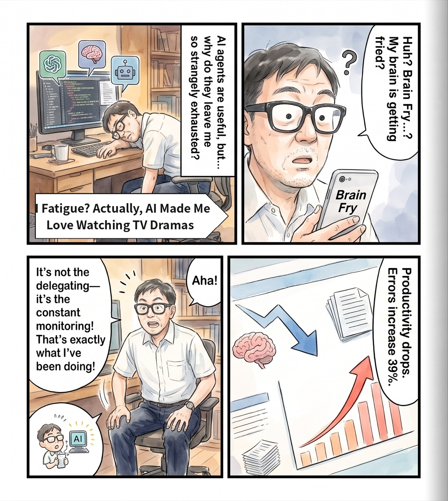
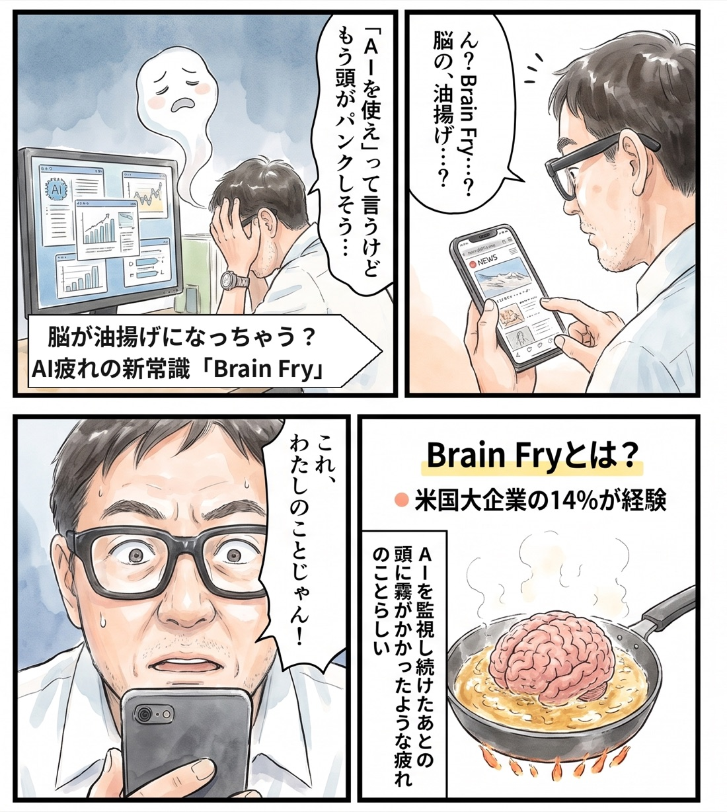

# Recess

AI works, you take recess. Your video plays by itself while the agents work, and pauses to bring you back to the terminal when herdr calls.



```sh
curl -fsSLO https://raw.githubusercontent.com/tatsuro-ueda/recess/main/install.sh
sh install.sh
```

Then add `~/Applications/Recess.app` to Accessibility. macOS 14 or later, with [herdr](https://herdr.dev) 0.9.1 or later.

- While an agent works: the browser comes to front, one space key, the video plays.
- When an agent asks or finishes: one space key, the terminal comes to front, the video pauses.
- Only `Recess.app`, a one-line AppleScript app, sends the key. The Accessibility permission goes to it and nothing else. The Python daemon gets none.
- `recess off` makes it watch only.

Before you start, open a video in the window right behind your terminal, and leave it paused. Recess only sends one space key, so a video that is already playing ends up inverted.

- **Install guide**: requirements, the two commands, the one permission, on/off, who wrote this → [docs/install.md](docs/install.md)
- **Specification**: how it decides (state diagram), settings, logs and stopping, known weaknesses → [docs/spec.md](docs/spec.md)

Feel Physics / Tatsuro Ueda — [feel-physics.jp](https://feel-physics.jp/). MIT, see [LICENSE](LICENSE).

---

# Recess（日本語）

AI が働く間は休み時間。動画は勝手に再生され、herdr に呼ばれたら止まってターミナルへ戻る。



```sh
curl -fsSLO https://raw.githubusercontent.com/tatsuro-ueda/recess/main/install.sh
sh install.sh
```

そのあと `~/Applications/Recess.app` をアクセシビリティに追加する。macOS 14 以降と [herdr](https://herdr.dev) 0.9.1 以降が要る。

- AI が働いている間：ブラウザが前に出て、スペースキー1回、動画が動く。
- AI が質問したか終わったら：スペースキー1回、ターミナルが前に出て、動画が止まる。
- キーを送るのは AppleScript 1行のアプリ `Recess.app` だけ。アクセシビリティの許可はこれにだけ出す。常駐の python3 には何も渡さない。
- `recess off` で見張るだけになる。

始める前に、すぐ後ろのウィンドウで動画を開き、一時停止しておいてください。Recess はスペースキーを1回送るだけなので、再生中のまま始めると逆向きになります。

- **導入方法**：動作の前提、2行のコマンド、許可、ON/OFF、誰が書いたか → [docs/install.md](docs/install.md#recess-導入方法日本語)
- **仕様詳細**：どう判断しているか（状態遷移図）、設定、ログと止め方、分かっている弱点 → [docs/spec.md](docs/spec.md#recess-仕様詳細日本語)

Feel Physics / 植田達郎 — [feel-physics.jp](https://feel-physics.jp/)。MIT。[LICENSE](LICENSE) を見てください。
