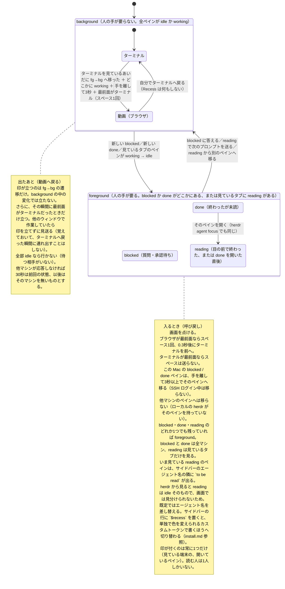

# Recess: specification

English first, 日本語は後半（[日本語へ](#recess-仕様詳細日本語)）. Back to the [README](../README.md). Install guide: [install.md](install.md).

## State diagram

How it decides. Two big states, and Recess only moves you on the transitions between them.

Recess reads only what herdr reports for each pane, so it does not know what kind of work an agent is doing. A side conversation (Claude Code's `/btw`) is treated exactly like any other turn: the pane goes `working` when it starts and `done` when it ends. One caveat: a turn that finishes in under two seconds can slip between polls and never be seen as `working`.


## Settings

All settings are environment variables. Put them in the `EnvironmentVariables` dict of `~/Library/LaunchAgents/jp.feel-physics.recess.plist`, then reload:

```sh
launchctl bootout   gui/$(id -u)/jp.feel-physics.recess
launchctl bootstrap gui/$(id -u) ~/Library/LaunchAgents/jp.feel-physics.recess.plist
```

| Variable | Default | What it does |
|---|---|---|
| `RECESS_HERDR_BIN` | set by `install.sh` to the herdr it found; otherwise `herdr` on PATH | Path to the herdr binary. |
| `RECESS_POLL_SECONDS` | `2` | How often to ask herdr. |
| `RECESS_HANDS_OFF_SECONDS` | `3` | Hands-off time before going to the video, and before an auto jump. |
| `RECESS_RETURN_COOLDOWN_SECONDS` | `20` | After calling you back, no video for this long. |
| `RECESS_TERMINAL_APPS` | `iTerm2 Terminal Ghostty kitty Alacritty WezTerm cmux` | Process names counted as "terminal", space-separated. |
| `RECESS_BROWSER_APPS` | `Safari,Comet,Google Chrome,Firefox,Arc,Brave Browser,Microsoft Edge` | App names counted as "browser", comma-separated. Only these are remembered as the place to return the video to. |
| `RECESS_VIDEO_APP` | (empty) | Force one browser, e.g. `Safari`. Empty = the browser you last used, Safari until then. |
| `RECESS_DEFAULT_TERMINAL` | `iTerm` | The app name passed to `open -a` when you are called back before Recess has seen you on a terminal. |
| `RECESS_ANNOUNCE_SECONDS` | `5` | How long `Moving to <app>` stays on screen before it switches. `0` = switch at once (no notification, no wait). |
| `RECESS_READING_LABEL` | `to be read` | What a reading pane shows in the sidebar. Empty = show nothing. |
| `RECESS_READING_TOKEN` | `recess` | The custom pane token that carries it. Put `$<name>` in a sidebar row to see it. |
| `RECESS_DRY_RUN` | (unset) | `1` = write the decisions to the log but press nothing, switch nothing and change no label. |

A good first day: `RECESS_DRY_RUN=1`, read the log, then turn it on.

## Logs, stopping, removing

Log: `~/.local/state/recess/watch.log`. Most lines start with `state:` (a status summary, written when it changes), `PLAY`, `RETURN`, `TOGGLE`, `JUMP`, `WAKE`, or `remote <name>: unreachable` / `back`. launchd's own output goes to `watch.stdout.log` and `watch.stderr.log` in the same directory; look at `watch.stderr.log` when it does not start.

`recess status` prints the mode, then every pane with what it is doing and whether it is holding a trip back. Only two things about a pane can hold one back: it is `blocked` / `done` (someone is waiting for you), or it is marked reading in the tab you are looking at. `working` does not hold anything back — it is the thing Recess waits for. Each line is named by its herdr tab label — the name in your sidebar — not by the terminal title, so the list reads the same as the screen you are looking at; when a label cannot be read it falls back to the title. The line above the list carries the rest of the conditions (front app, how long your hands have been off, where it would take you). All of it is read from `~/.local/state/recess/status.json`, which the daemon overwrites every poll; `status` never judges for itself, because a second copy of the rules would drift and then tell you the wrong reason. When that file is older than 15 seconds, `status` says the daemon has stopped instead of guessing.

Each `TOGGLE` line names the app the space key was sent to (`target=Comet (front=iTerm2)`). Before it moves, a notification says `Moving to Comet in 5s` and it waits that long, so you can read where it is about to go — a notification shown after the switch arrives too late to read. If you touch the keyboard while it waits, it does not go (`cancelled: hands back on` in the log) and announces again once your hands rest. That is how you catch a space key landing on the wrong window. To silence the notification (and the wait): `touch ~/.local/state/recess/announce-off`.

To make Recess ignore a pane entirely (for example an agent that runs on a timer and would otherwise call you back every round), write part of its pane title on a line of `~/.local/state/recess/ignore`. A matching pane is treated as if it did not exist: it never calls you back, never counts as working, and never gets the reading label. The file is read every poll, so no restart is needed. Lines starting with `#` are comments.

```sh
tail -f ~/.local/state/recess/watch.log          # watch it decide
launchctl print gui/$(id -u)/jp.feel-physics.recess | grep state   # is it running?
```

Stop (stays stopped until you bootstrap it again or log in again):

```sh
launchctl bootout gui/$(id -u)/jp.feel-physics.recess
```

Start again:

```sh
launchctl bootstrap gui/$(id -u) ~/Library/LaunchAgents/jp.feel-physics.recess.plist
```

Remove everything: `uninstall.sh` (next to `install.sh` in the repository) removes what `install.sh` put there. `--purge` also removes the logs and state, `--dry-run` only shows what it would do.

```sh
sh uninstall.sh            # add --purge to remove ~/.local/state/recess too
```

By hand, it is:

```sh
launchctl bootout gui/$(id -u)/jp.feel-physics.recess
rm ~/Library/LaunchAgents/jp.feel-physics.recess.plist
rm -r ~/.local/share/recess ~/.local/state/recess
rm -r ~/Applications/Recess.app
rm ~/.local/bin/afplay      # only if you installed with --with-afplay
```

Then remove Recess from the Accessibility list in System Settings, and from the Automation list if it is there. ssh connection-sharing sockets (`~/.ssh/ctl-recess-*`) close by themselves within 10 minutes.

### The optional afplay wrapper

herdr plays a sound when an agent finishes or asks. `--with-afplay` installs `~/.local/bin/afplay`, a short shell script: if its parent process is herdr, it wakes the display (`caffeinate -u -t 2`), appends one line to `~/.local/state/recess/sound.log` and then hands over to the real `/usr/bin/afplay`; for any other caller it just runs the real one. It only works if `~/.local/bin` comes before `/usr/bin` in the PATH of the shell that starts herdr. It is off by default because it shadows a system command.

## Known weaknesses

- The reading mark needs `herdr pane report-metadata` (herdr 0.9.1) and a sidebar row carrying either `agent` (the default does) or `$recess`. Which one Recess writes is decided by looking for `$recess` in `config.toml` as text; it does not parse the TOML, and an unreadable file falls back to the always-visible `agent` route. `--state-label` was tried first and stayed invisible: the default rows carry `state_icon`, not `state_text`.
- Space is a toggle. Pause or play by hand and the next press goes the wrong way. Recess never reads playback state; keep the video paused while you are at the terminal.
- Tried with Safari and Netflix only. Other sites or players may not bind space to play/pause, or may not have the video focused.
- "Browser is frontmost" does not mean "right tab, video focused". If a text field or another tab has focus, space goes there.
- Rebuilding Recess.app (`sh install.sh --rebuild-app`, or a re-run that finds the app broken or built by an older `install.sh`; otherwise a plain re-run keeps it) can invalidate the permission. Remove Recess from the Accessibility list and add it again; if it is still refused, quit System Settings, open it again, and repeat. On the author's Mac, macOS had stored the permission by path but checked the identity of the new build.
- Tried only on macOS 14.3.1 with herdr 0.9.1 and iTerm2, on one Mac. No one has run it anywhere else yet.
- If you are called back while in an app that is neither a terminal nor a browser (Finder, an editor), it still brings the browser forward and presses space.
- It can take you to the video while you are thinking with your hands off the keys, as long as an agent in the tab you look at is `working`.
- A remote machine that stops answering keeps its last known state. It is not treated as gone.
- On a remote machine, `herdr agent list` runs in a non-interactive shell. If `~/.local/bin` is not on PATH there, the machine is silently treated as unreachable and Recess watches this Mac only. The log line `remote <name>: unreachable` is the only sign.
- While an `enabled` machine is down, one polling round can stretch to 5 seconds per such machine (ssh connect timeout).
- Hands-off time comes from this Mac's input devices. Typing over ssh from a phone does not count as hands; the auto jump checks `who` for that, the switch to the video does not.
- On a slow ssh link, a call from a remote machine arrives as late as the next `herdr agent list` does.


---

# Recess 仕様詳細（日本語）

[README へ戻る](../README.md)。導入方法は [install.md](install.md#recess-導入方法日本語)。

## 状態遷移図

どう判断しているか。大きな状態は2つだけで、Recess があなたを動かすのは、その間の遷移のときだけです。

Recess が読むのは herdr が返すペインの状態だけなので、AI が何の仕事をしているかは分かりません。サイド会話（Claude Code の `/btw`）も普通のやり取りと同じ扱いで、始まれば `working`、終われば `done` になります。ただし2秒たらずで終わるやり取りは、2秒おきの見回りをすり抜けて `working` として見えないことがあります。



## 設定（環境変数）

設定はすべて環境変数です。`~/Library/LaunchAgents/jp.feel-physics.recess.plist` の `EnvironmentVariables` に書いて、載せ直します：

```sh
launchctl bootout   gui/$(id -u)/jp.feel-physics.recess
launchctl bootstrap gui/$(id -u) ~/Library/LaunchAgents/jp.feel-physics.recess.plist
```

| 変数 | 既定 | 意味 |
|---|---|---|
| `RECESS_HERDR_BIN` | `install.sh` が見つけた herdr の場所。無ければ PATH 上の `herdr` | herdr 実行ファイルの場所。 |
| `RECESS_POLL_SECONDS` | `2` | herdr に聞く間隔（秒）。 |
| `RECESS_HANDS_OFF_SECONDS` | `3` | 動画へ行く前、および自動ジャンプの前に、手を離して待つ秒数。 |
| `RECESS_RETURN_COOLDOWN_SECONDS` | `20` | 呼び戻したあと、この秒数は動画へ行かない。 |
| `RECESS_TERMINAL_APPS` | `iTerm2 Terminal Ghostty kitty Alacritty WezTerm cmux` | 「ターミナル」とみなすプロセス名。空白区切り。 |
| `RECESS_BROWSER_APPS` | `Safari,Comet,Google Chrome,Firefox,Arc,Brave Browser,Microsoft Edge` | 「ブラウザ」とみなすアプリ名。カンマ区切り。動画の戻り先として覚えるのはこれらだけ。 |
| `RECESS_VIDEO_APP` | （空） | ブラウザを決め打ちする（例 `Safari`）。空なら最後に使ったブラウザ、それまでは Safari。 |
| `RECESS_DEFAULT_TERMINAL` | `iTerm` | まだターミナルを見ていないうちに呼び戻されたとき、`open -a` に渡すアプリ名。 |
| `RECESS_ANNOUNCE_SECONDS` | `5` | 移る前に `Moving to <アプリ>` を出して待つ秒数。`0` ですぐ移る（通知も待ちも無し）。 |
| `RECESS_READING_LABEL` | `to be read` | 読み中のペインがサイドバーに出す文言。空にすると出さない。 |
| `RECESS_READING_TOKEN` | `recess` | その文言を入れるカスタムトークン名。サイドバーの行に `$<名前>` を置くと見える。 |
| `RECESS_DRY_RUN` | （未設定） | `1` で、判断はログに書くが何も押さず、何も切り替えず、表示も差し替えない。 |

最初の1日は `RECESS_DRY_RUN=1` でログだけ読み、それから本番にするのがおすすめです。

## ログと止め方・削除

ログ：`~/.local/state/recess/watch.log`。行頭はおもに `state:`（状態の要約。変わったときだけ書く）、`PLAY`、`RETURN`、`TOGGLE`、`JUMP`、`WAKE`、`remote <名前>: unreachable` / `back` のどれかです。launchd 自身の出力は同じフォルダの `watch.stdout.log` と `watch.stderr.log` に出ます。起動しないときは `watch.stderr.log` を見てください。

`recess status` は ON / OFF のあとに、ペイン一覧と「それが連れ出しを妨げているか」を出します。ペインが妨げる理由は2つだけです。`blocked` / `done`（誰かが待っている）か、見ているタブで読み中になっているか。`working` は妨げません。むしろ recess が待っている相手です。各行の名前は、ターミナルのタイトルではなく **herdr のタブ名**（サイドバーに出ている名前）です。見ている画面と同じ名前で並びます。ラベルが読めないときはタイトルに落ちます。一覧の上の行に、残りの条件（最前面のアプリ・手を離した秒数・連れ出し先）が出ます。値はすべて `~/.local/state/recess/status.json` から読みます。常駐が毎周書き換えるファイルで、`status` 側では何も判定しません。判定を2か所に置くと、いつかずれて**間違った理由を教える**からです。このファイルが15秒より古いときは、推測せずに「常駐が止まっている」と言います。

`TOGGLE` の行には、スペースを送った相手のアプリ名が残ります（`target=Comet (front=iTerm2)`）。移る**前**に「`Moving to Comet in 5s`」と通知を出し、その秒数だけ待ってから移ります（移ったあとに出しても、画面が変わっているので読めません）。待っている間に手を動かしたら移りません（ログは `cancelled: hands back on`）。次に手が止まれば、また知らせてから移ります。スペースが別のウィンドウへ飛んでいるときは、これで気づけます。通知と待ち時間がうるさいときは `touch ~/.local/state/recess/announce-off` で止まります。

特定のペインを丸ごと無視させたいとき（定期実行のループのように、毎回終わるたびに呼び戻されては困るペイン）は、`~/.local/state/recess/ignore` にそのペイン名の一部を1行ずつ書きます。合ったペインは無いものとして扱い、呼び戻しにも、働いている判定にも、読み中の印にも使いません。ファイルは毎回読み直すので再起動は要りません。`#` で始まる行はコメントです。

```sh
tail -f ~/.local/state/recess/watch.log          # 判断を眺める
launchctl print gui/$(id -u)/jp.feel-physics.recess | grep state   # 動いているか
```

止める（載せ直すか、次にログインするまで止まったまま）：

```sh
launchctl bootout gui/$(id -u)/jp.feel-physics.recess
```

動かす：

```sh
launchctl bootstrap gui/$(id -u) ~/Library/LaunchAgents/jp.feel-physics.recess.plist
```

全部消す：リポジトリで `install.sh` の隣にある `uninstall.sh` が、`install.sh` の置いたものを外します。`--purge` を付けるとログと状態も消し、`--dry-run` は何をするかを表示するだけです。

```sh
sh uninstall.sh            # ~/.local/state/recess も消すなら --purge
```

手で消すなら：

```sh
launchctl bootout gui/$(id -u)/jp.feel-physics.recess
rm ~/Library/LaunchAgents/jp.feel-physics.recess.plist
rm -r ~/.local/share/recess ~/.local/state/recess
rm -r ~/Applications/Recess.app
rm ~/.local/bin/afplay      # --with-afplay で入れたときだけ
```

そのあと、システム設定のアクセシビリティ一覧から Recess を外してください。オートメーション一覧に残っていればそれも外します。ssh の接続共有ソケット（`~/.ssh/ctl-recess-*`）は10分以内に勝手に閉じます。

### 任意の afplay ラッパー

herdr はエージェントが終わったときと質問したときに音を鳴らします。`--with-afplay` は `~/.local/bin/afplay` に短いシェルスクリプトを置きます。親プロセスが herdr なら画面を点け（`caffeinate -u -t 2`）、`~/.local/state/recess/sound.log` に1行書いてから本物の `/usr/bin/afplay` へ渡し、それ以外の呼び出し元なら本物をそのまま実行するだけです。herdr を起動するシェルの PATH で `~/.local/bin` が `/usr/bin` より前にあるときだけ効きます。システムのコマンドを覆い隠すので、既定では入れません。

## 分かっている弱点

- 読み中の印は `herdr pane report-metadata`（herdr 0.9.1）と、サイドバーの行に `agent`（既定にある）か `$recess` のどちらかがあることに頼っている。どちらで書くかは `config.toml` に `$recess` という文字列があるかで決める。TOML は解析しないし、読めなければ必ず出る `agent` 側へ倒す。最初に試した `--state-label` は画面に出なかった（既定の行が `state_icon` だけで `state_text` を持たない）。
- スペースは切り替えです。手で止めたり再生したりすると、次の1回が逆に効きます。Recess は再生状態を読みません。ターミナルにいる間は動画を止めておいてください。
- 確かめたのは Safari と Netflix だけ。他のサイトやプレーヤーではスペースが再生／停止に割り当てられていなかったり、動画にフォーカスが無かったりします。
- 「ブラウザが最前面」は「正しいタブで動画にフォーカスがある」と同じではありません。文字入力欄や別のタブにフォーカスがあれば、スペースはそこへ行きます。
- Recess.app を作り直す（`sh install.sh --rebuild-app`。再実行で app が壊れているか古い版と分かったときも作り直します。それ以外のただの再実行では作り直しません）と、許可が外れることがあります。アクセシビリティ一覧から Recess を削除して追加し直してください。それでも拒否されるときは、システム設定を終了してもう一度開き、同じことを繰り返します。作者の Mac では、macOS が許可をパスで記録しつつ、新しいビルドの識別を照合していました。
- 確かめたのは macOS 14.3.1、herdr 0.9.1、iTerm2、Mac 1台だけ。それ以外で動かした人はまだいません。
- ターミナルでもブラウザでもないアプリ（Finder やエディタ）を見ているときに呼び戻されると、それでもブラウザを前に出してスペースを押します。
- 見ているタブの AI が `working` なら、手を離して考えごとをしている最中でも動画へ連れて行かれることがあります。
- 応答しなくなった他のマシンは、最後に分かった状態を持ち続けます。いなくなった扱いにはしません。
- 他のマシンでは `herdr agent list` を非対話シェルで実行します。相手の PATH に `~/.local/bin` が無いと、黙って unreachable 扱いになり、この Mac だけの監視になります。気づける手がかりはログの `remote <名前>: unreachable` だけです。
- `enabled` のマシンが落ちている間は、1周が落ちているマシン1台につき最大5秒（ssh の接続待ち）延びます。
- 手を離した秒数はこの Mac の入力装置から取ります。スマホから ssh で打っていても「手」には数えません。自動ジャンプは `who` でそれを見ますが、動画への切り替えは見ません。
- ssh が遅いと、他のマシンからの呼び出しは次の `herdr agent list` が返るまで遅れます。

